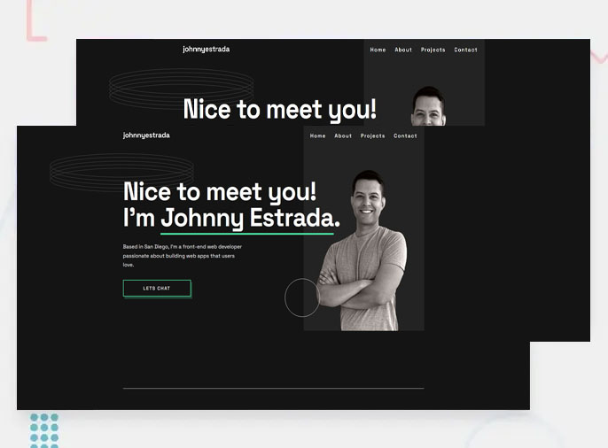

#  Developer Portfolio

## Overview 

This is [my personal web developer portfolio](https://www.johnnyestrada.dev) showcasing my projects, skills, and experience. The portfolio is built using **Astro**, vanilla CSS, and JavaScript. It's a static site with a contact form and interactive elements to highlight my work.

## Table of Contents 

1. [About](#about)
2. [Projects](#projects)
3. [Skills](#skills)
4. [Contact](#contact)
5. [License](#license)

---

## Projects 💻

Here are some of the projects featured in [my portfolio](https://www.johnnyestrada.dev/#projects):

- **Klarity Issue Tracking Web App**: Klarity is an issue tracker web application built with MySQL, React, TypeScript, Node.js, Express, and Tailwind CSS. It provides a platform for managing and tracking issues, facilitating collaboration and organization within teams.
- **Interpreter in Go**: In progress.

---

## Skills 🛠️

- **Programming**: HTML, CSS, JavaScript, TypeScript
- **Technology**: Netlify, DigitalOcean, Docker
- **Frameworks/Libraries**: React, Tailwind, Express
- **Content Management**: Tridion, Documentum
- **Database/ORM**: MySQL, Sequelize
- **Web Server**: Node.js
- **Tools**: Git, GitHub, JIRA, ClearQuest, VScode
- **Business**: SharePoint, MS Office, Agile, SCRUM, Waterfall

---

## Contact 📧

Feel free to reach out to me through the contact form on my portfolio website. I'm open to collaborations, job opportunities, or just a friendly chat!

---

## License 📝

This portfolio is licensed under the [MIT License](https://mit-license.org/).
